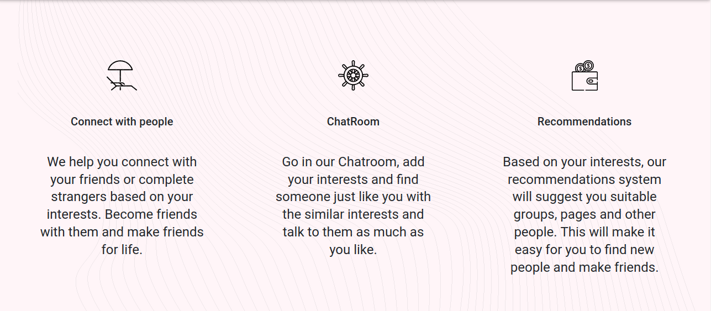
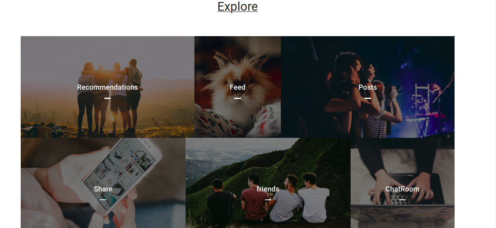
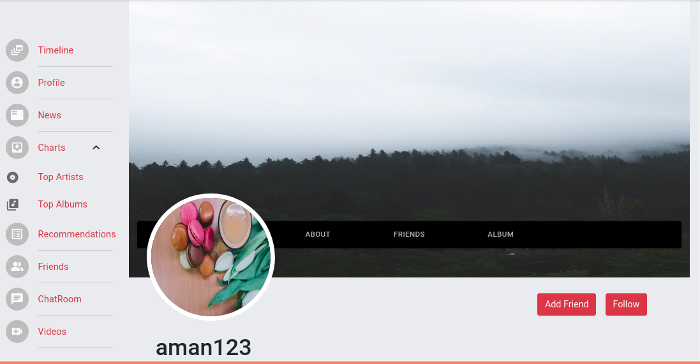
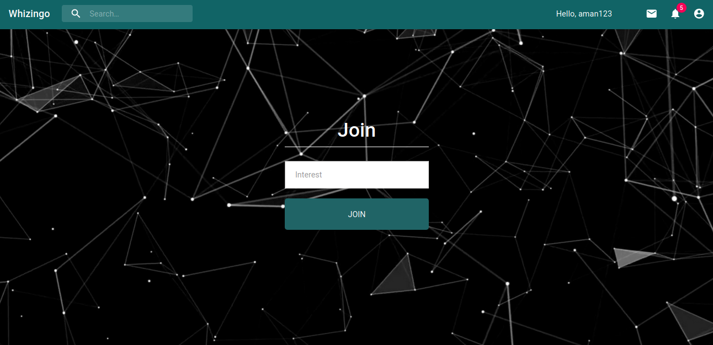
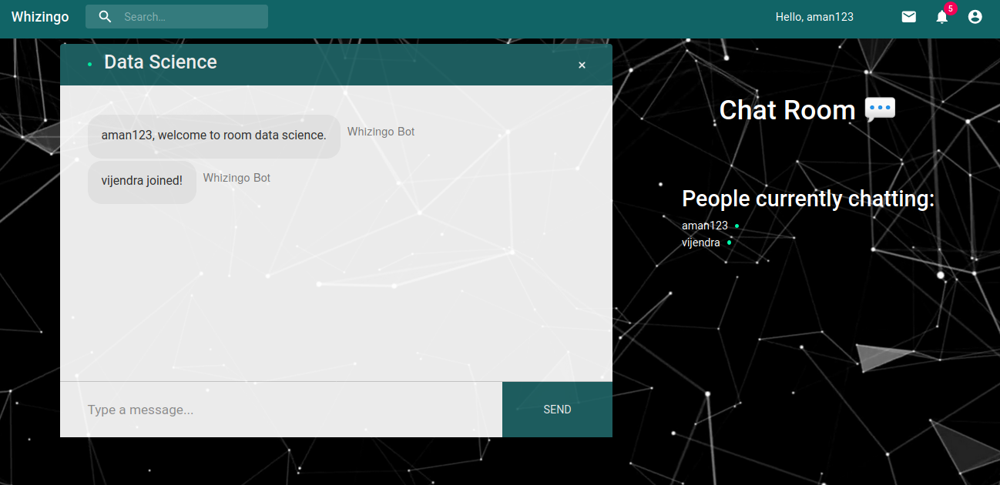
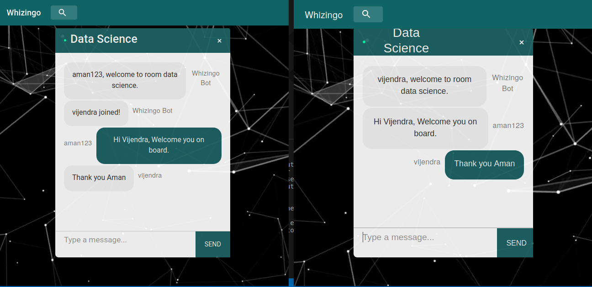
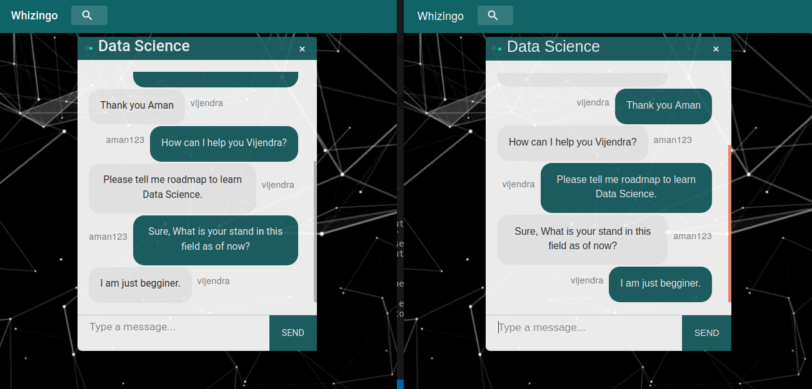

# Whizingo - The Social Network

This is my academic project as a part of ``Service Oriented Application Development(SOAD)`` Course - Mansoon 2019-20

   
   
  
  

## Proposal

Whizingo is a platform for individuals and organizations to use for creating, sharing, exchanging, discussing information, ideas and pictures or videos. It's goal is to bring similar minded people together so that they can interact and have a healthy conversation amongst them. It's try to rank users on the basis of their activities on our platform which would help in future recommendations for the user as well as help the groups also to decide whether he is good enough to become a member of that group. This would improve the functioning of the groups and they will not be polluted by bad members.

## Installation

Before doing anything you have to clone or download(and unzip) the project folder, open terminal and navigate to the project folder and run:

```bash
npm i
```

This will install all the dependencies required by the project.

## Getting Started

To start using this API, start your local database server, open terminal and navigate to the project folder and run:

```bash
npm run dev
```

### demo
 <br>
 <br>
 <br>
  <br>
     <br>
     <br>
     <br>
     <br>
     

<br>

## APIs Documentation

### User Authorization endpoints
<table>
	<tr>
		<th>S.No.</th>
		<th>Route</th>
		<th>Method</th>
		<th>Access</th>
		<th>Description</th>
	</tr>
	<tr>
        <td>1.</td>
        <td>api/users/resgitser</td>
        <td>POST</td>
        <td>public</td>
        <td>register users</td>
    </tr>
	 <tr>
        <td>2.</td>
        <td>api/users/login</td>
        <td>POST</td>
        <td>public</td>
        <td>login users</td>
    </tr>
	 <tr>
        <td>3.</td>
        <td>api/users/current</td>
        <td>GET</td>
        <td>private</td>
        <td>returns current user</td>
    </tr>

</table>


### Profile endpoints

<table>
	<tr>
		<th>S.No.</th>
		<th>Route</th>
		<th>Method</th>
		<th>Access</th>
		<th>Description</th>
	</tr>
	<tr>
		<td>1.</td>
		<td>api/profile</td>
		<td>GET</td>
		<td>Private</td>
		<td>to get personal profile</td>
	</tr>
	<tr>
		<td>2.</td>
		<td>api/profile</td>
		<td>POST</td>
		<td>Private</td>
		<td>create or edit profile</td>
	</tr>
	<tr>
		<td>3.</td>
		<td>api/profile/user/:user_id</td>
		<td>GET</td>
		<td>Public</td>
		<td>get profile by user ID</td>
	</tr>
	<tr>
		<td>4.</td>
		<td>api/profile/all</td>
		<td>GET</td>
		<td>Public</td>
		<td>get all profiles</td>
	</tr>
	<tr>
        <td>5.</td>
        <td>api/profile/expericence</td>
        <td>POST</td>
        <td>Private</td>
        <td>add experience to profile</td>
    </tr>
	<tr>
        <td>6.</td>
        <td>api/profile/expericence/:exp_id</td>
        <td>DELETE</td>
        <td>Private</td>
        <td>delete experience from profile</td>
    </tr>
	 <tr>
        <td>7.</td>
        <td>api/profile/education</td>
        <td>POST</td>
        <td>Private</td>
        <td>add education to profile</td>
    </tr>
	<tr>
        <td>8.</td>
        <td>api/profile/education/:edu_id</td>
        <td>DELETE</td>
        <td>Private</td>
        <td>delete education from profile</td>
    </tr>
	<tr>
        <td>9.</td>
        <td>api/profile</td>
        <td>DELETE</td>
        <td>Private</td>
        <td>delete user and profile</td>
    </tr>

</table>

### Post endpoints

<table>
    <tr>
        <th>S.No.</th>
        <th>Route</th>
        <th>Method</th>
        <th>Access</th>
        <th>Description</th>
    </tr>
    <tr>
        <td>1.</td>
        <td>api/posts/</td>
        <td>GET</td>
        <td>public</td>
        <td>get all posts</td>
    </tr>
    <tr>
        <td>2.</td>
        <td>api/posts/:id</td>
        <td>POST</td>
        <td>public</td>
        <td>get post by id</td>
    </tr>
	<tr>
        <td>3.</td>
        <td>api/posts/</td>
        <td>POST</td>
        <td>private</td>
        <td>create post</td>
    </tr>
    <tr>
        <td>4.</td>
        <td>api/posts/:id</td>
        <td>DELETE</td>
        <td>private</td>
        <td>delete post by id</td>
    </tr>
	<tr>
        <td>5.</td>
        <td>api/posts/like/:id</td>
        <td>POST</td>
        <td>private</td>
        <td>like post</td>
    </tr>
    <tr>
        <td>6.</td>
        <td>api/posts/unlike/:id</td>
        <td>POST</td>
        <td>private</td>
        <td>unlike post</td>
    </tr>
	<tr>
        <td>7.</td>
        <td>api/posts/comment/:id</td>
        <td>POST</td>
        <td>private</td>
        <td>add comment to post</td>
    </tr>
    <tr>
        <td>8.</td>
        <td>api/posts/comment/:id/:comment_id</td>
        <td>DELETE</td>
        <td>private</td>
        <td>remove comment from post</td>
    </tr>


</table>

### Friend Request endpoints

<table>
    <tr>
        <th>S.No.</th>
        <th>Route</th>
        <th>Method</th>
        <th>Access</th>
        <th>Description</th>
    </tr>
    <tr>
        <td>1.</td>
        <td>api/friends/all</td>
        <td>GET</td>
        <td>private</td>
        <td>get all friends</td>
    </tr>
    <tr>
        <td>2.</td>
        <td>api/friends/requestsent</td>
        <td>POST</td>
        <td>private</td>
        <td>friend request sent</td>
    </tr>
    <tr>
        <td>3.</td>
        <td>api/friends/requestaccept</td>
        <td>POST</td>
        <td>private</td>
        <td>friend request accept</td>
    </tr>
	<tr>
        <td>4.</td>
        <td>api/friends/requestcancel</td>
        <td>POST</td>
        <td>private</td>
        <td>friend request cancel</td>
    </tr>


</table>


### Recommendations endpoints

Friend Suggestions:- 
<table>
    <tr>
        <th>S.No.</th>
        <th>Route</th>
        <th>Method</th>
        <th>Access</th>
        <th>Description</th>
    </tr>
    <tr>
        <td>1.</td>
        <td>api/recommendations</td>
        <td>GET</td>
        <td>private</td>
        <td>get recommendations</td>
    </tr>

</table>


### Notifications endpoints

<table>
    <tr>
        <th>S.No.</th>
        <th>Route</th>
        <th>Method</th>
        <th>Access</th>
        <th>Description</th>
    </tr>
    <tr>
        <td>1.</td>
        <td>api/notification/all</td>
        <td>GET</td>
        <td>private</td>
        <td>get all notifications</td>
    </tr>
	<tr>
        <td>2.</td>
        <td>api/notification/seen/:id</td>
        <td>POST</td>
        <td>private</td>
        <td>post seen notification</td>
    </tr>


</table>


### Message endpoints

<table>
    <tr>
        <th>S.No.</th>
        <th>Route</th>
        <th>Method</th>
        <th>Access</th>
        <th>Description</th>
    </tr>
    <tr>
        <td>1.</td>
        <td>api/message/received/:id</td>
        <td>GET</td>
        <td>private</td>
        <td>get received message of a id</td>
    </tr>
    <tr>
        <td>2.</td>
        <td>api/message/sent/:id</td>
        <td>GET</td>
        <td>private</td>
        <td>get sent message of a id</td>
    </tr>
	<tr>
        <td>3.</td>
        <td>api/message/send/:id</td>
        <td>POST</td>
        <td>private</td>
        <td>post send message of a id</td>
    </tr>
    <tr>
        <td>4.</td>
        <td>api/message/:id</td>
        <td>DELETE</td>
        <td>private</td>
        <td>delete message of a id</td>
    </tr>

</table>

